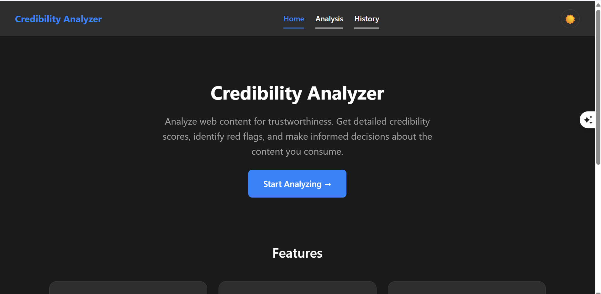
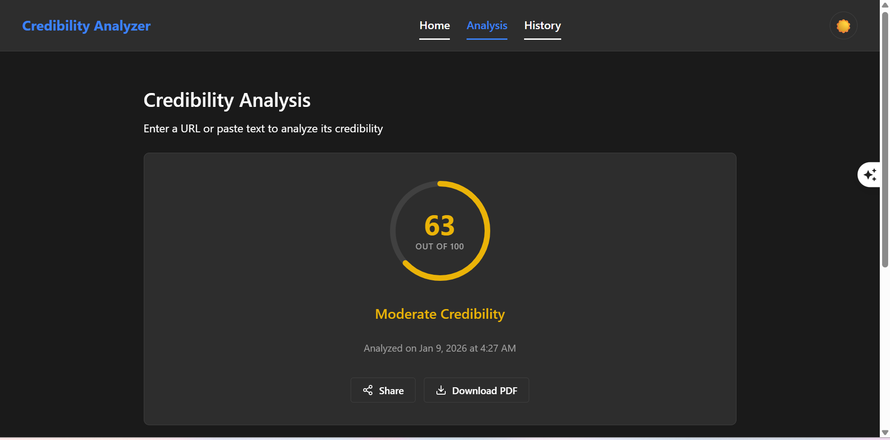

# 🔍 Credibility Analyzer

A full-stack web application that analyzes the credibility of online content using machine learning. Get instant credibility scores, identify red flags, and make informed decisions about the content you consume.


## 📋 Table of Contents

- [Features](#-features)
- [Screenshots](#-screenshots)
- [Architecture](#-architecture)
- [Tech Stack](#-tech-stack)
- [Getting Started](#-getting-started)
- [Installation](#-installation)
- [Configuration](#-configuration)
- [Usage](#-usage)
- [API Documentation](#-api-documentation)
- [Deployment](#-deployment)
- [Contributing](#-contributing)
- [License](#-license)
- [Author](#-author)

## ✨ Features

- **Real-time Credibility Analysis** - Analyze URLs or text content instantly
- **ML-Powered Scoring** - Advanced machine learning models for accurate credibility assessment
- **Detailed Reports** - Get comprehensive breakdowns with red flags and positive indicators
- **Dark/Light Mode** - Beautiful UI with theme support
- **Export Options** - Download reports as PDF or share results
- **Analysis History** - Track and review your past analyses
- **Responsive Design** - Works seamlessly on desktop and mobile devices
- **Fast & Secure** - Built with security best practices and optimized performance

## 📸 Screenshots

### Home Page
The landing page introduces users to the Credibility Analyzer with a clean, modern interface.

<p align="center">
  
</p>

### Analysis Results
View detailed credibility scores with visual indicators and actionable insights.

<p align="center">
  
</p>

## 🏗 Architecture

```
┌─────────────────┐     ┌─────────────────┐     ┌─────────────────┐
│                 │     │                 │     │                 │
│    Frontend     │────▶│   Backend API   │────▶│   ML Service    │
│    (React)      │     │   (Node.js)     │     │   (Python)      │
│                 │     │                 │     │                 │
└─────────────────┘     └────────┬────────┘     └─────────────────┘
                                 │
                    ┌────────────┴────────────┐
                    │                         │
              ┌─────▼─────┐           ┌───────▼───────┐
              │           │           │               │
              │  MongoDB  │           │    Redis      │
              │           │           │   (Cache)     │
              └───────────┘           └───────────────┘
```

## 🛠 Tech Stack

### Frontend
- **React 19** - Modern UI library
- **TypeScript** - Type-safe development
- **Vite** - Fast build tool
- **React Router** - Client-side routing
- **Axios** - HTTP client

### Backend
- **Node.js** - Runtime environment
- **Express** - Web framework
- **TypeScript** - Type-safe development
- **MongoDB** - Database
- **Redis** - Caching layer
- **Zod** - Schema validation

### ML Service
- **Python 3.11** - Programming language
- **Flask** - Web framework
- **Transformers** - NLP models
- **PyTorch** - Deep learning framework
- **Gunicorn** - Production WSGI server

### DevOps
- **Docker** - Containerization
- **Docker Compose** - Multi-container orchestration
- **GitHub Actions** - CI/CD pipeline
- **Nginx** - Reverse proxy & load balancer
- **Prometheus & Grafana** - Monitoring

## 🚀 Getting Started

### Prerequisites

- Node.js >= 20.0.0
- Python >= 3.11
- Docker & Docker Compose (optional)
- MongoDB (local or Atlas)
- Redis (optional, for caching)

### Quick Start with Docker

```bash
# Clone the repository
git clone https://github.com/anjali04853/credibility-analyzer.git
cd credibility-analyzer

# Start all services
docker-compose --profile self-hosted up -d

# Access the application
# Frontend: http://localhost:5173
# Backend API: http://localhost:3000
# ML Service: http://localhost:5000
```

## 📦 Installation

### Manual Installation

#### 1. Clone the Repository
```bash
git clone https://github.com/anjali04853/credibility-analyzer.git
cd credibility-analyzer
```

#### 2. Install Frontend Dependencies
```bash
cd credibility-analyzer
npm install
```

#### 3. Install Backend Dependencies
```bash
cd ../backend
npm install
```

#### 4. Install ML Service Dependencies
```bash
cd ../ml-service
pip install -r requirements.txt
```

## ⚙️ Configuration

### Frontend Environment Variables

Create `credibility-analyzer/.env`:
```env
VITE_API_URL=http://localhost:3001
VITE_APP_ENV=development
```

### Backend Environment Variables

Create `backend/.env`:
```env
NODE_ENV=development
PORT=3001
ML_SERVICE_URL=http://localhost:5000
CORS_ORIGINS=http://localhost:5173
MONGODB_URI=mongodb://localhost:27017/credibility
REDIS_URI=redis://localhost:6379
```

### ML Service Environment Variables

Create `ml-service/.env`:
```env
FLASK_ENV=development
PORT=5000
USE_GPU=false
```

## 🎯 Usage

### Running in Development Mode

#### Start all services:

**Terminal 1 - ML Service:**
```bash
cd ml-service
python -m flask run --port 5000
```

**Terminal 2 - Backend:**
```bash
cd backend
npm run dev
```

**Terminal 3 - Frontend:**
```bash
cd credibility-analyzer
npm run dev
```

### Running with Docker Compose

```bash
# Development mode
docker-compose --profile self-hosted up

# Production mode
docker-compose -f docker-compose.production.yml up -d
```

### Analyzing Content

1. Open the application in your browser
2. Navigate to the **Analysis** page
3. Enter a URL or paste text content
4. Click **Analyze** to get credibility results
5. View the score, red flags, and positive indicators
6. Download PDF report or share results

## 📚 API Documentation

### Endpoints

#### Health Check
```http
GET /health
```

#### Analyze Content
```http
POST /api/analyze
Content-Type: application/json

{
  "url": "https://example.com/article",
  // OR
  "text": "Content to analyze..."
}
```

#### Response
```json
{
  "id": "uuid",
  "score": 75,
  "category": "Moderate Credibility",
  "overview": "Analysis summary...",
  "redFlags": [
    {
      "type": "sensational_language",
      "description": "Excessive use of emotional language",
      "severity": "medium"
    }
  ],
  "positiveIndicators": [
    {
      "type": "cited_sources",
      "description": "Article includes source citations"
    }
  ],
  "timestamp": "2026-01-09T10:30:00Z"
}
```

#### Get Analysis by ID
```http
GET /api/analyze/:id
```

## 🌐 Deployment

### Deploy to Render

1. Push your code to GitHub
2. Go to [Render Dashboard](https://dashboard.render.com)
3. Create a new Blueprint and connect your repository
4. Render will detect `render.yaml` and create all services
5. Configure environment variables
6. Set up MongoDB Atlas for database

See [docs/RENDER_DEPLOYMENT.md](docs/RENDER_DEPLOYMENT.md) for detailed instructions.

### Deploy with Docker

```bash
# Build images
docker-compose -f docker-compose.production.yml build

# Deploy
docker-compose -f docker-compose.production.yml up -d
```

## 🧪 Testing

### Run Frontend Tests
```bash
cd credibility-analyzer
npm test
```

### Run Backend Tests
```bash
cd backend
npm test
```

### Run ML Service Tests
```bash
cd ml-service
pytest
```

## 📁 Project Structure

```
credibility-analyzer/
├── credibility-analyzer/     # React frontend
│   ├── src/
│   │   ├── app/              # App configuration
│   │   ├── features/         # Feature modules
│   │   ├── shared/           # Shared components
│   │   ├── services/         # API services
│   │   └── styles/           # Global styles
│   └── package.json
├── backend/                  # Node.js API
│   ├── src/
│   │   ├── controllers/      # Route handlers
│   │   ├── services/         # Business logic
│   │   ├── middleware/       # Express middleware
│   │   ├── database/         # MongoDB integration
│   │   └── cache/            # Redis caching
│   └── package.json
├── ml-service/               # Python ML service
│   ├── app/
│   │   ├── analyzer.py       # ML analysis logic
│   │   ├── routes.py         # Flask routes
│   │   └── main.py           # Application entry
│   └── requirements.txt
├── monitoring/               # Prometheus & Grafana
├── nginx/                    # Nginx configuration
├── scripts/                  # Deployment scripts
├── docs/                     # Documentation
├── docker-compose.yml        # Docker orchestration
├── render.yaml               # Render deployment
└── README.md
```

## 🤝 Contributing

Contributions are welcome! Please follow these steps:

1. Fork the repository
2. Create a feature branch (`git checkout -b feature/amazing-feature`)
3. Commit your changes (`git commit -m 'Add amazing feature'`)
4. Push to the branch (`git push origin feature/amazing-feature`)
5. Open a Pull Request

### Development Guidelines

- Follow the existing code style
- Write tests for new features
- Update documentation as needed
- Keep commits atomic and well-described

## 📄 License

This project is licensed under the MIT License - see the [LICENSE](LICENSE) file for details.

## 👩‍💻 Author

**Anjali Verma**

- GitHub: [@anjali04853](https://github.com/anjali04853)

---

## 🙏 Acknowledgments

- [Hugging Face Transformers](https://huggingface.co/transformers/) for NLP models
- [React](https://reactjs.org/) for the amazing UI library
- [Express](https://expressjs.com/) for the robust backend framework

---

<p align="center">
  Made with ❤️ by Anjali Verma
</p>
